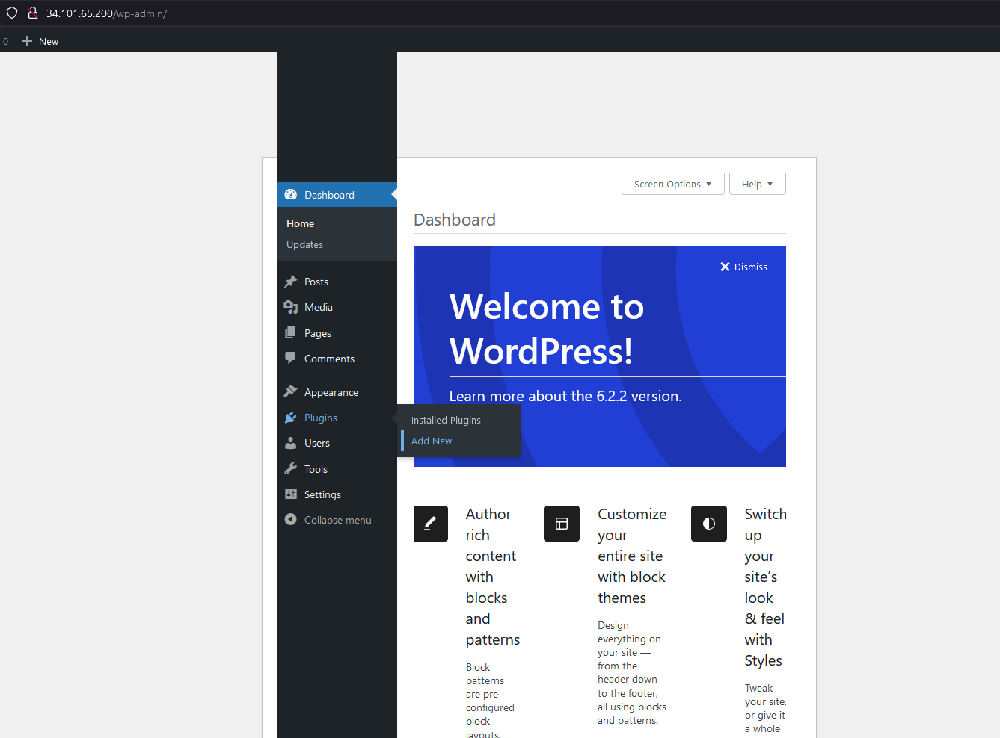

SSO
===

.. table::
   :widths: auto
   :align: center

   +----------------------+------------------------------------------------------------------+
   |**Person in charge**  | M Sendi Siradj `@sendisiradj <https://github.com/SendiSiradj>`_  |
   +----------------------+------------------------------------------------------------------+
   |**Service**           | SSO Integration                                                  |
   +----------------------+------------------------------------------------------------------+
   |**Aplikasi**          | Keycloak                                                         |
   +----------------------+------------------------------------------------------------------+

Aplikasi integrasi SSO yang digunakan dalam tugas ini adalah Keycloak. Kami memilih Keycloak karena merupakan solusi *open-source* yang paling sering digunakan dan relatif mudah digunakan. Dengan Keycloak, kami dapat membuat 2 jenis protokol untuk authorization yaitu OpenID atau SAML 2.0. Namun untuk instalasi pada kali ini, kami memilih protokol OpenID yang akan diterapkan.

Pada proses instalasi Keycloak, kami menggunakan Helm sebagai *package manager* untuk menginstall dan mengelola aplikasi di dalam cluster Kubernetes kami. Helm memungkinkan kami untuk dengan mudah mendefinisikan dan menyebarkan konfigurasi Keycloak serta komponen-komponen terkaitnya dalam lingkungan Kubernetes. Selain itu, Helm juga memungkinkan kami untuk melakukan *upgrade* dan *rollback* secara mudah serta memastikan bahwa kami memiliki versi Keycloak yang konsisten.

Setelah itu kami akan mengintegrasikan aplikasi Wordpress yang sudah dipasang sebelumnya agar proses *authentication* atau *login* dapat menggunakan akun Keycloak yang sudah di *define* di konfigurasi *console* Keycloak.

Prerequisites
-------------
Instalasi Keycloak dapat dilakukan jika kluster sudah memenuhi beberapa hal berikut:

- Sudah memiliki *host* database
- Kluster Kubernetes aktif
- Wordpress beserta Persistent Volume Claim (PVC) yang sesuai

Proses Instalasi
----------------
Pemasangan fitur SSO pada kluster ini setidaknya memiliki 6 langkah utama, yaitu mulai dari mempersiapkan *database*, instalasi Helm, instalasi Keycloak, konfigurasi Keycloak, instalasi *plugin* OpenID Connect, dan terakhir konfigurasi *plugin* WordPress.

Deployment Keycloak kami luncurkan sebagai sebuah service tersendiri dan memiliki external IP yang dapat diakses melalui http://34.101.223.88 . Semua *resource* yang dipasang untuk deployment Keycloak berada pada *namespace* "default".

Berikut ini adalah detail dari langkah-langkah yang dilakukan untuk instalasi SSO menggunakan Keycloak :

Mempersiapkan *Database* Keycloak
~~~~~~~~~~~~~~~~~~~~~~~~~~~~~~~~~
Pada kluster ini sudah terinstal *host* database dari MariaDB. Saya hanya perlu membuat database dan *user* Keycloak di dalam *host* tersebut. Masuk ke dalam *console* MariaDB melalui terminal dan sambungkan MariaDB dengan menjalankan perintah :

.. code-block:: sql

   CREATE DATABASE keycloak;
   GRANT ALL PRIVILEGES ON keycloak.* TO 'keycloak'@'%' IDENTIFIED BY 'password';
   FLUSH PRIVILEGES;
   EXIT;

   membuat database dan user baru pada MariaDB

Setelah itu, Cek nama *service* MariaDB yang sudah diinstal.

.. code-block:: bash

   kubectl get svc

.. figure:: ../assets/keycloak-images/keycloak-image10.png
   :align: center

   mendapatkan nama service host database

Instalasi *Package Manager* Helm
~~~~~~~~~~~~~~~~~~~~~~~~~~~~~~~~
Helm memudahkan kita untuk melakukan instalasi Keycloak karena Helm sudah melakukan pre-konfigurasi dan Helm juga menyediakan segala dependency yang dibutuhkan untuk menjalankan Keycloak.
Saya menggunakan Helm chart yang di *mantain* oleh Codecentric. Sebelum kita menginstal Helm kita perlu mempersiapkan *repository* dan file konfigurasi terlebih dahulu. Pertama, kita menambahkan repository ``codecentric`` yang isinya adalah *collection* chart Helm.

.. code-block:: bash

   helm repo add codecentric https://codecentric.github.io/helm-charts

.. figure:: ../assets/keycloak-images/keycloak-image19.png
   :align: center

   Helm chart dari codecentric

Kemudian, buat sebuah file yaml bernama ``values.yaml`` untuk chart Keycloak Helm. File ini menyimpan konfigurasi Keycloak Helm yang akan digunakan pada projek ini.

.. code-block:: yaml

 keycloak:
  persistence:
    dbVendor: mariadb
    dbName: keycloak
    dbHost: mariadb-1-mariadb
    dbUser: keycloak
    dbPassword: password
  username: admin
  password: admin
  ingress:
    enabled: false
  extraEnv: |
    - name: KEYCLOAK_FRONTEND_URL
      value: "http://<External-IP>/auth"

   isi values.yaml

value **<External-IP>** akan diganti nanti. Untuk saat ini simpan ``values.yaml`` terlebih dahulu.

Sekarang kita dapat menginstal *chart* Keycloak dengan menggunakan konfigurasi yang sudah disimpan di ``values.yaml``.

.. code-block:: bash

   helm install keycloak codecentric/keycloak -f values.yaml --namespace default

.. figure:: ../assets/keycloak-images/keycloak-image13.png
   :align: center

   instal chart Helm

Setelah proses instal selesai, cek apakah *service* Keycloak sudah berjalan.

.. code-block:: bash

   kubectl get svc --namespace default

.. figure:: ../assets/keycloak-images/keycloak-image4.png
   :align: center

   daftar `service` yang ada pada `namespace` ``default``

Pada tahap ini, *service* Keycloak sudah dapat dijalankan namun hanya bisa dilakukan di dalam kluser. Artinya kita harus melakukan *port-forwarding* terlebih dahulu melalui terminal kluster. Setelah itu, dashboard `console` admin Keycloak bisa dibuka.
Tentu saja ini membuat pengalaman memakai *console* admin akan menjadi terbatas. Oleh karena itu, kita butuh melakukan *expose* agar *console* admin dapat diakses dari luar.

*Deployment* Keycloak via Helm
~~~~~~~~~~~~~~~~~~~~~~~~~~~~~~

*Service* keycloak sudah terdaftar dan berjalan. Selanjutnya kita perlu melakukan *expose* ke *pod* yang memiliki *service* Keycloak yang tadi agar bisa diakses diluar dari kluster. Nama *pod* yang dipakai adalah ``keycloak-0``. Saya menamakan *service* yang diekspos tersebut ``keycloak-external``.

.. figure:: ../assets/keycloak-images/keycloak-image9.png
   :align: center

   expose pod yang mengandung service Keycloak

Kemudian cek apakah *service* ``keycloak-external`` sudah berjalan.

.. figure:: ../assets/keycloak-images/keycloak-image20.png
   :align: center

   daftar service pada namespace default

Disini kita mendapatkan *external* IP *service* tersebut adalah 34.101.223.88:80.

Setelah itu buka file ``values.yaml`` dan ganti <External-IP> menjadi *external* IP *service* ``keycloak-external``.

.. figure:: ../assets/keycloak-images/keycloak-image18.png
   :align: center

   update external IP pada ``values.yaml``

Terakhir lakukan perintah Helm upgrade untuk menerapkan perubahan.

.. code-block:: bash

   helm upgrade keycloak codecentric/keycloak -f values.yaml --namespace default

.. note::

   Catatan tambahan, karena kita menggunakan Helm maka kita dapat  menggunakan banyak *service* untuk penginstalan Keycloak dengan mudah. Awalnya kita menggunakan *service* ``keycloak-http`` untuk menjalankan Keycloak di dalam kluster. Namun setelah melakukan
   *upgrade* kita dapat menggunakan *service* ``keycloak-external`` untuk mengakses Keycloak dari luar. Ini juga menjadi salah satu keuntungan dari Helm.

Konfigurasi admin Keycloak
~~~~~~~~~~~~~~~~~~~~~~~~~~

Pada tahap ini, consol admin Keycloak sudah dapat diakses pada http://34.101.223.88/. Jika belum pernah mendaftarkan *username* dan *password* maka akan muncul halaman pendaftaran, jika sudah maka tampilan nya berubah menjadi halaman *login*. Masukkan credential admin untuk masuk ke dashboard.

   halaman login consol Keycloak

Kita butuh untuk membuat Realm baru khusus untuk aplikasi WordPress. Realm merupakan administrasi top-level untuk otentikasi dan otorisasi pada Keycloak. Dengan membuat Realm maka kita dapat memastikan manajemen user, konfigurasi SSO, dan integrasi penyedia identitas eksternal berada dalam satu tempat. Contoh, kita dapat membuat satu akun user di Keycloak yang nantinya dapat dipakai *login* ke WordPress.
Kita akan menamakan Realm ini dengan nama ``WordPress``. Untuk membuat Realm, klik *dropdown* pada kiri atas bar navigasi dan pilih **Add realm**.

   membuat Realm ``WordPress``

Setelah membuat Realm, kita harus membuat *client* dan *user*. Untuk membuat *client* pilih **Client** pada bar navigasi. Isi informasi *client* seperti berikut :

.. code-block:: yaml

   Client ID: wordpress
   Root URL: http://34.101.65.200
   Valid Redirect URIs: /*
   Base URL: /
   Client Protocol: openid-connect
   Access Type: public

Simpan informasi *client* tersebut. Setelah itu, kita perlu membuat *user* yang nantinya akan kita pakai untuk *login* ke consol admin WordPress.
Untuk membuat *user* pilih **Users** pada bar navigasi dan klik **Add user**. Isi informasi *user* seperti berikut :

.. code-block:: yaml

   username: sendi
   email: sendisiradj@gmail.com
   First name: Muhammad Sendi
   Last name: Siradj
   password: admin
   Temporary: OFF

Jangan lupa untuk mengatur **Temporary : OFF** dikarenakan kita berniat untuk terus memakai *password* tersebut.

Konfigurasi admin Keycloak sudah selesai sampai disini.

Instalasi *plugin* OpenID Connect pada WordPress
~~~~~~~~~~~~~~~~~~~~~~~~~~~~~~~~~~~~~~~~~~~~~~~~~~

Pada bagian ini, kita akan menginstal *plugin* pada WordPress untuk menghubungkan otentikasi dan otorisasi WordPress dengan Keycloak. Jika WordPress di *deploy* menggunakan lebih dari 1 *pod* maka pastikan sudah menginstal PVC terlebih dahulu.
Ini dikarenakan *plugin* akan disimpan dalam *filesystem* WordPress sehingga butuh *storage* yang konsisten agar tidak bermasalah saat kluster berpindah-pindah *pods*.

Masuk ke halaman consol admin WordPress melalui http://34.101.65.200/wp-admin/ dan masuk menggunakan akun admin WordPress. Akun ini didapatkan ketika pertama kali menginstal WordPress.
Untuk menginstal plugin, pilih menu **Plugins** dan pilih **Add new** pada bar navigasi consol admin Wordpress. Kemudian cari *plugin* bernama "OpenID Connect Generic". Kita juga dapat menginstall *plugin* dengan cara mengunduh *plugin* ini melalui :
https://wordpress.org/plugins/daggerhart-openid-connect-generic/

   bar navigasi consol admin WordPress

Konfigurasi *plugin* OpenID Connect pada Wordpress
~~~~~~~~~~~~~~~~~~~~~~~~~~~~~~~~~~~~~~~~~~~~~~~~~~~~

Setelah itu tekan tombol **Activate** pada *plugin* tersebut. Jika sudah, maka kita bisa melihat ada menu tambahan yaitu "OpenID Generic Client" pada *section* **Settings** di bar navigasi admin.

   OpenID Connect Client setting

Setelah itu isi informasi *setting* seperti berikut :

.. code-block:: yaml

   Client ID: wordpress
   Scope: openid email
   Endpoint Login URL: http://34.101.223.88/auth/realms/WordPress/protocol/openid-connect/auth
   Endpoint Userinfo URL: http://34.101.223.88/auth/realms/WordPress/protocol/openid-connect/userinfo
   Endpoint Token URL: http://34.101.223.88/auth/realms/WordPress/protocol/openid-connect/token
   Endpoint Logout URL: http://34.101.223.88/auth/realms/WordPress/protocol/openid-connect/logout
   Identity Key: preferred_username

Informasi *endpoint* di atas juga bisa didapatkan melalui consol admin Keycloak pada bagian **Realm settings > Endpoints > OpenID Endpoint Configuration**.
Kemudian pada *section* **WordPress User Setting** kita perlu mencentang **Link Existing Users** agar *user* yang sudah kita buat di Keycloak dapat masuk ke WordPress. Jika tidak maka WordPress akan mengembalikan *error* **User Creation Failed** saat *login* menggunakan *user* dari Keycloak.

Berikut ini adalah gambaran *setting* untuk *plugin* OpenID Connect :

   setting plugin

   aktifkan **Link Existing Users**

Tekan tombol **Save Changes** jika sudah selesai dengan *setting*.

Skenario Testing
----------------

Untuk melakukan *testing*, kita dapat *logout* dari consol admin WordPress. Setelah itu kita akan diarahkan ke halaman *login*. Saatnya kita menggunakan *user* yang sudah kita buat di Keycloak pada langkah sebelumnya.

   login via OpenID Client

Pilih tombol *Login with OpenID Client*.
*Username* akun tadi adalah ``sendi``

   masuk menggunakan username dan password user Keycloak

Voila! kita sudah berhasil *login* menggunakan *user* dari Keycloak.

   halaman dashboard *user* ``sendi``

Terakhir, pastikan *user* ``sendi`` sudah tercatat sebagai user WordPress dengan cara klik tombol **Users** pada bar navigasi WordPress.

Referensi
---------

- `"OpenID Connect Generic Client" extension for WordPress <https://oa.dnc.global/spip.php?page=unarticle&id_article=112&lang=en>`_
- `codecentric repository <https://codecentric.github.io/helm-charts>`_
