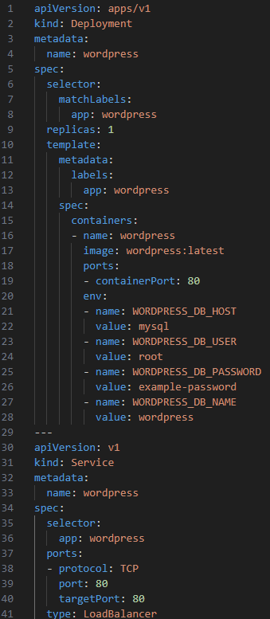

Web Profile
===========
.. table::
   :widths: auto
   :align: center

   +----------------------+------------------------------------------------------------------+
   |**Person in charge**  | Eyota Wakanda `@eyotawakanda https://github.com/eyotawakanda`_   |
   +----------------------+------------------------------------------------------------------+
   |**Service**           | Web Profile                                                      |
   +----------------------+------------------------------------------------------------------+
   |**Aplikasi**          | WordPress                                                        |
   +----------------------+------------------------------------------------------------------+

Aplikasi untuk Web Profile yang digunakan untuk tugas ini adalah WordPress. Kami memilih WordPress karena aplikasi WordPress merupakan aplikasi paling sederhana yang dapat digunakan untuk memenuhi kebutuhan dari tugas ini.

Berikut adalah langkah-langkah instalasi Wordpress

Proses Instalasi
----------------

Langkah pertama yang butuh dilakukan adalah membuat file .yaml sesuai dengan kebutuhan

Berikut adalah contoh file .yaml yang digunakan untuk membuat web profile sederhana

Dari .yaml file di atas, beberapa bagian yang harus diubah adalah jumlah replica dan env. Jumlah replica bisa di atur berdasarkan keinginan. Env akan diatur untuk menyesuaikan dengan database yang disiapkan.

.yaml yang diberikan merupakan gabungan dari .yaml deployment dan .yaml service. Hasil yang sama bisa dicapai dengan membuat 2 .yaml file terpisah. 

Menggunakan File .yaml
----------------

Untuk melakukan perubahan pada cluster, bisa digunakan command berikut pada GCloud Console

.. code-block:: bash
   
   kubectl apply <nama-file-yaml>.yaml
 
Skenario Testing
----------------

TODO
